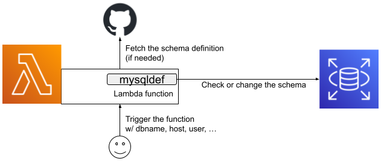

# Packaging mysqldef for AWS Lambda

This is the easy-to-run maintenance free AWS Lambda function package of [k0kubun/sqldef](https://github.com/k0kubun/sqldef) for MySQL.



The database schema management tool [k0kubun/sqldef](https://github.com/k0kubun/sqldef) is really nice, but it is always problem where we should run it. If our database is in a closed network on a cloud service, we should create and maintain a virtual server to run sqldef for a long time. It's also a problem that we can't run sqldef triggered by CIs in such environment.

This repository is to package the mysqldef binary and a script with some more files of schema and keys into a .zip file, which is available as a Lambda function. Once you place the package onto your AWS environment, you can trigger sqldef schema management with schema files on GitHub repositories.

An example event data to trigger this function:

```json
{
  "database_name": "mydata",
  "database_host": "mydata.cluster-xxxxxxxx.ap-northeast-1.rds.amazonaws.com",
  "database_username": "root",
  "database_password": "SECRET_DATABASE_PASSWORD",
  "input": {
    "type": "github",
    "repository": "exampleorg/myproject",
    "schema_path": "db/schema.sql",
    "key_name": "myproject_deploy_key1"
  },
  "dry_run": true
}
```

Put the event above into the "Test" event JSON and execute it, then what you get::

```
{
  "statusCode": 200,
  "body": "\"Done\""
}

START RequestId: 9cd66c4e-f5d7-4fdd-ba0d-ba313db134c7 Version: $LATEST
2023-05-02T09:43:05.603Z	9cd66c4e-f5d7-4fdd-ba0d-ba313db134c7	INFO	-------------- stdout --------------
-- dry run --
CREATE TABLE `notifications` (
  `id` bigint NOT NULL AUTO_INCREMENT,
  `uuid` varchar(36) NOT NULL,
  `subject` text NOT NULL,
(snip)
```

You can check the `--dry-run` results, then turn `"dry_run": true` into `false` and apply the changes actually.

#### Can it fetch DB schema from GitHub private repository?

Yes. This package can contain SSH keys to be specified in triggering events. So you can create a deploy key of your private repository, then package it into the .zip file. Lambda function will fetch the schema file by the deploy key (if specified so).

#### Can it manage RDS (Aurora) databases in private VPCs?

Definitely! This project's main purpose is to maintain DB schema of an Aurora database in a private VPC originally.

#### What's the benefit of Lambda function?

You don't have to maintain the environment to execute sqldef.

#### What's the benefit of Lambda function, compared to ECS task (or any other things)?

It's easier to setup a Lambda function than any others.

#### Why is it a classic .zip package instead of a container?

AWS Lambda environment is a modified Linux environment, which prohibits `seteuid` required by git+ssh. I couldn't find a good workaround of the problem, but found [git-lambda-layer](https://github.com/lambci/git-lambda-layer) for the classic Lambda package.

#### Is it only for MySQL?

Yes. You can easily fork this repository and modify the script for PostgreSQL or MS SQL.

#### Is it only for AWS Lambda?

Yes.

## Run mysqldef from AWS Lambda

1. Clone this repository
2. Put your schema SQL files into `includes/` if you want to bundle schema file into .zip package
3. Put your deployment key file into `deploy_keys/` if you want to fetch schema files from your private repository
4. Build the package by running `./build.sh`, and get `pkg/mysqldef_lambda.zip`
5. Create a Lambda function within your VPC network (if needed), with a layer of [git-lambda-layer](https://github.com/lambci/git-lambda-layer)

### AWS CLI to create the Lambda function

This is just an example of Lambda function creation. You can use AWS CLI, AWS Management Console or any other ways to create it.

```
$ aws lambda create-function \
    --function-name myproject-mysqldef \
    --runtime nodejs18.x \
    --package-type Zip \
    --handler index.handler \
    --zip-file fileb://$(pwd)/pkg/mysqldef_lambda.zip \
    --role arn:aws:iam::MY_ACCOUNT:role/RoleToManageDatabases \
    --vpc-config SubnetIds=subnet-xxx,subnet-yyy,SecurityGroupIds=sg-zzzzzz \
    --architectures x86_64 \
    --layers arn:aws:lambda:YOUR_REGION:553035198032:layer:git-lambda2:8 \
    --timeout 60
```

The requirements of this package are:

| option | value |  |
| --- | --- | --- |
| runtime | nodejs18.x | fixed value |
| handler | index.handler | fixed value |
| role    | ARN of your IAM role | the IAM role must be able to access the DB |
| vpc-config | SubnetIds=...,SecurityGroupIds=... | subnets and security groups of your VPC if needed |
| architecture | x86_64 | fixed value |
| layers | ARNs of Lambda layers | See below |
| timeout | 60 | the default (3 seconds) is too short to clone a git repository |

### Using git-lambda-layer

The AWS Lambda function prohibits `seteuid` call, which is required by usual git+ssh. As the workaround of this problem, this package needs a Lambda layer of a patched `git` command, [git-lambda-layer](https://github.com/lambci/git-lambda-layer).

This Lambda function script uses `git` and `ssh` commands to clone private repositories. To execute `git clone`, the Lambda function of this package needs to be configured with a Lambda layer of `git-lambda-layer` to replace `git` command by the patched version.

You can choose [any of available versions](https://github.com/lambci/git-lambda-layer#version-arns-for-amazon-linux-2-runtimes), but newer should be better.

## Configuration

Many things can be configured via both environment variables and events. Values from events are prior to values from environment variables.

But the 2 things below must be specified by events:

- Database schema source (files in the package, or GitHub.com repository)
- Dry-run or not (dry-run in default)

### Event JSON

Event JSON should be like:

```json
{
  "database_name": "mydata",
  "database_host": "mydata.cluster-xxxxxxxx.ap-northeast-1.rds.amazonaws.com",
  "database_username": "root",
  "database_password": "SECRET_DATABASE_PASSWORD",
  "input": {
    "type": "github",
    "repository": "exampleorg/myproject",
    "schema_path": "db/schema.sql",
    "key_name": "myproject_deploy_key1"
  },
  "dry_run": true
}
```

#### Mandatory attributes

- `input`: the database schema input, a string (filename) or an object 

If the value of `input` is a string, it means a filename, that should be in `includes/` directory (without `includes/`).

If the value of `input` is an object, it should/can have attributes below:

- `type`: must be `"github"`
- `repository`: the `account/repo` style repository name
- `schema_path`: the file path of the schema file in the repository
- `branch`: the branch name (default: `main`)
- `key_name`: the deploy key file name, should be in `deploy_keys/`

The deploy key name must be specified for private repositories.

#### Optional attributes

- `database_name`: the name of the database
- `database_host`: the hostname of MySQL database
- `database_port`: the port number of MySQL database (default: `3306`)
- `database_username`: the username (default: `root`)
- `database_password`: the password of the specified user
- `dry_run`: specify `--dry-run` option (`true`) or not (`false`) (default: `true`)

### environment variables

- `DATABASE_NAME`
- `DATABASE_HOST`
- `DATABASE_PORT`
- `DATABASE_USERNAME`
- `DATABASE_PASSWORD`

## TODOs

#### Better secrets management

The database password and SSH keys can be fetched from AWS Secrets Manager (or any other sources).

## Development and Testing on localhost

Prerequisites:

- Docker
- MySQL on the docker host (or in the local network)
- Create a database `deftest` on the MySQL

Steps:

1. Clone this repository
2. (Add modifications if needed)
3. Execute `./build.sh` to build the container
4. Run the container: `docker run -e DATABASE_HOST=host.docker.internal -e DATABASE_PORT=3306  -p 9000:8080 mysqldef-lambda`
5. Trigger the function: `curl -XPOST "http://localhost:9000/2015-03-31/functions/function/invocations" -d '{"database_name":"deftest","input":{"type":"github","repository":"tagomoris/mysqldef_lambda_container","schema_path":"example/schema.sql","branch":"branch-for-schema-file"}}' | jq .`
